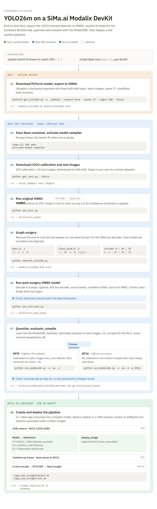
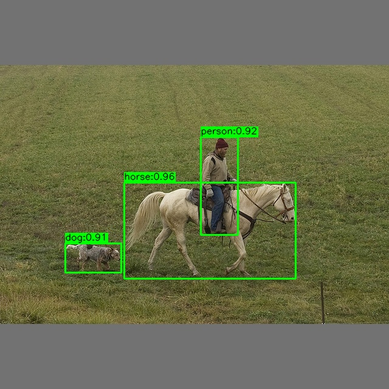
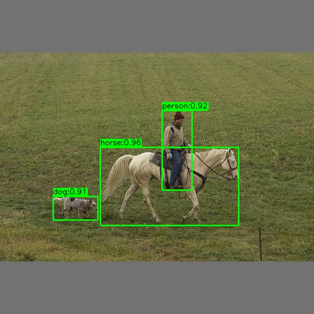
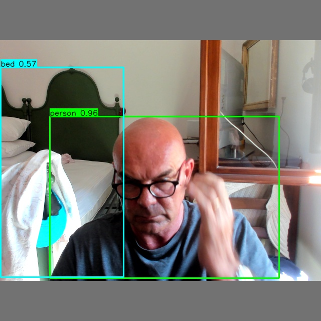

# Yolov26m example

End-to-end example of running the COCO-trained YOLO26m detector on a SiMa.ai Modalix DevKit.
The stock ONNX export is rewritten to expose the six raw detection-head tensors, then quantized and
compiled with the ModelSDK so box decoding runs on the hardware BoxDecode rather than inside the graph.

## Software and hardware used in this example

- SiMa.ai Modalix DevKit — Modalix SoM board (aarch64), with the MLA accelerator for inference and the EV74 CVU for preprocessing.
- DevKit platform firmware / system image: `2.1.3_master_B4837`, built on 2026-08-19; eLxr 12 (aria), Linux kernel `6.18.3-modalix`.
- SiMa Neat SDK: `2.1.3.0`, using Docker image `ghcr.io/sima-neat/sdk:v2.1.3.0` for the development and cross-compilation environment.
- SiMa ModelSDK: `2.1.3`, used to quantize, evaluate, and compile the YOLO26m model.
- SiMa Neat runtime and GStreamer plugins: `0.4.0` on the DevKit, used to run the preprocessing, inference, and detection-decoding pipeline.
- Neat EV74 CVU firmware package: `0.4.0` (`neat-ev74-firmware`).
- Neat Insight: bundled with Neat SDK `2.1.3.0`, used to view the annotated video the C++ Neat application streams to the host.


## Files in this repository

### Python scripts

| Script | Step | Interpreter | Description |
| --- | --- | --- | --- |
| `get_yolo26m.py` | #1 | host | Download the COCO-trained `.pt` checkpoint and export it to ONNX via Ultralytics, slimmed with onnxslim. |
| `get_coco.py` | #3 | Model SDK venv | Download COCO samples and letterbox them to 640x640 into `./calib_images` and `./test_images`. |
| `run_onnx.py` | #4 | Model SDK venv | Run the stock end-to-end export over a folder of frames with onnxruntime. The floating-point reference everything later is compared against. |
| `rewrite_yolo26m.py` | #5 | Model SDK venv | Cut the end-to-end tail off the export and expose the raw per-level `bbox_0..2` / `class_prob_0..2` head tensors that Neat's `BoxDecode` expects. |
| `run_onnx_mod.py` | #6 | Model SDK venv | Run the post-surgery model and decode the head tensors in numpy, reproducing what `BoxDecode` does on the target. |
| `run_modelsdk.py` | #7 | Model SDK venv | Quantize (INT8 or BF16), optionally evaluate on the test frames, and compile for the MLA. |
| `utils.py` | #4, #6, #7 | Model SDK venv | The COCO class names, image listing, output-folder preparation and box drawing, shared so the ONNX references and the Model SDK script cannot drift apart. Decoding is deliberately not here: each model variant needs its own. |

"Model SDK venv" means `/sdk-extensions/model-compiler/bin/python3` inside the
Neat SDK container - what `activate-model-compiler` puts on the path - not the
container's default `python3`. See STEP #2.

### Agentic AI prompts

| Prompt | Description |
| --- | --- |
| `run_onnx_mod_prompt.md` | Specification for `run_onnx_mod.py`: ONNX inference of the post-surgery model with the box decode done in numpy (STEP #6). |
| `run_modelsdk_prompt.md` | Specification for `run_modelsdk.py`: quantize, evaluate and compile with the SiMa.ai Model SDK (STEP #7). |
| `usb_insight_prompt.md` | Specification for the C++ Neat application in `./app_usb_insight`: USB camera in, annotated H.264 out to Neat Insight (STEP #8). |


### Skills for agentic AI

| File | Description |
| --- | --- |
| `agent_skills/SKILL.md` | The skill itself: how to write a Model SDK script for this example, and what to ask about rather than assume. |
| `agent_skills/assets/template.py` | Skeleton Model SDK script. The agent fills only the `# === AGENT:BEGIN` / `# === AGENT:END` sections; `run_modelsdk.py` was built from it. |
| `agent_skills/assets/utilities.py` | Helper functions for a Model SDK script: listing image files, preparing the results folder, and patching the pipeline sequence in a compiled archive. |
| `agent_skills/assets/preproc_lib.py` | Reference preprocessing steps - letterbox resize, mean subtraction, standard-deviation division - to merge into the script being written. |
| `agent_skills/assets/postproc_lib.py` | Reference post-processing for detection models: IoU, NMS, YOLOX output decoding and box drawing. Unused here: this model needs post-processing, but of a different shape - the YOLO26 head decodes per level with no NMS, so `run_modelsdk.py` mirrors Neat's `BoxDecode` instead, using the same decode `run_onnx_mod.py` does in STEP #6. |





## Preparation

Refer to the SiMa [Developer Center](https://developer.sima.ai/) and read it carefully before starting.

### Devkit preparation

Update the devkit to the firmware release that matches the SDK version used here,
following the SiMa.ai [firmware update instructions](https://developer.sima.ai/hardware/getting-started/firmware-update).
A mismatch between the devkit firmware and the SDK may cause the compiled model to fail to load on the target.

### Install the Neat tools

Follow the SiMa.ai [development environment setup guide](https://developer.sima.ai/software/getting-started/dev-environment/)
to install the Neat tools (`sima-cli`) and to set up and pair the devkit.
The rest of this example assumes that guide has been completed and that the devkit is reachable.


Note: All steps are driven from the host machine, not the devkit. Step #1 is run outside the Neat docker;
Steps #2 - #8 are run from inside it (STEP #8 reaches the paired devkit with `dk`).


## STEP 1: Download trained Yolov26m PyTorch model and convert to ONNX

The COCO-trained YOLO26m checkpoint is downloaded from the Ultralytics GitHub
releases as a PyTorch `.pt` file, then exported to ONNX with the settings the
SiMa tools expect: a fixed 640x640 input, static shapes, and simplification with
onnxslim. Both files are written to `./models`, giving `yolo26m.pt` and the
`yolo26m.onnx` that every later step works from.

Requires Ultralytics package to be installed (pip install ultralytics onnx onnxslim)
Execute *outside* the Neat docker container.

Note how the ONNX opset is set to 17, this is the version supported by the latest version of the Sima tools. 

```shell
$ python3 get_yolo26m.py -o ./models --export-onnx --opset 17 --imgsz 640 --force
```


## STEP 2: Start Neat container and activate model compiler

Access the Neat docker container:

```shell
$ sima-cli sdk neat
```

If a devkit is paired with the host machine, the prompt will appear like this with the devkit IP address:

```shell
[DevKit 192.168.1.20:/workspace] user@neat-sdk-v2.1.3.0:/workspace$
```

If no devkit is paired, then the prompt will appear like this:

```shell
user@neat-sdk-v2.1.3.0:/workspace$
```


Activate the model compiler environment like this:

```shell
[DevKit 192.168.1.20:/workspace] user@neat-sdk-v2.1.3.0:/workspace$ activate-model-compiler
```


## STEP 3: Download sample COCO images for calibration and test

100 images for calibration and 10 images for test are downloaded then resized and padded to be 640x640.

For custom datasets, add approximately 100 representative images to a folder named ./calib_images and approximately 10 images to a folder named ./test_images. Note that they should be 640x640.

```shell
(model-compiler) [DevKit 192.168.1.20:/workspace] user@neat-sdk-v2.1.3.0:/workspace$ python get_coco.py --force
```


## STEP 4: Run ONNX inference of original ONNX model

This step is optional, but it is recommended to test the original ONNX model to produce baseline results.

Each image in ./test_images is run through the original ONNX model with ONNX Runtime on the CPU.
The YOLO26 graph is end-to-end, so it emits already-decoded and sorted detections and only a
confidence threshold (0.25 by default) is applied. Per image, the detection count and classes are
printed to the console, and a copy annotated with the bounding boxes, class names and scores is
written to ./build/onnx_pred.


```shell
(model-compiler) [DevKit 192.168.1.20:/workspace] user@neat-sdk-v2.1.3.0:/workspace$ python run_onnx.py
```




## STEP 5: Graph Surgery

The original ONNX graph will be modified to make it compatible with the Sima box decoder.

The end-to-end tail of the graph - the reshape, concatenate, activate and detection-selection nodes -
is removed, and the six raw detection-head tensors are exposed as the model outputs instead: bbox_0..2
(1,4,H,W) and class_prob_0..2 (1,80,H,W) for strides 8/16/32, with H,W of 80/40/20. The class heads are
cut before the Sigmoid, since the Sima box decoder applies its own score activation and logits quantize
better. Any node no longer feeding an output is pruned, and the result is written to ./models/yolo26m_mod.onnx.


```shell
(model-compiler) [DevKit 192.168.1.20:/workspace] user@neat-sdk-v2.1.3.0:/workspace$ python rewrite_yolo26m.py
```


## STEP 6: Run ONNX inference of post-surgery model

Confirm that the post-surgery model gives the same results as the original model.

The same ./test_images are run through ./models/yolo26m_mod.onnx, but the decoding the graph used to do
now happens in numpy: a sigmoid on the class logits, an ltrb distance decode of the boxes, the three
levels concatenated, then the confidence filter and a top-k of max_det (no NMS - the head is NMS-free).
Detection counts and classes are printed per image and the annotated images are written to
./build/onnx_mod_pred. They should match the STEP 4 baseline in ./build/onnx_pred.

Before any of that the script checks that the class heads really do emit logits - it prints
`Class heads emit raw logits (class_prob_0 <- Conv, ...)` - and stops with a warning if an
activation is found, since its own sigmoid would otherwise double-activate them. run_modelsdk.py
makes the same check in STEP #7.

```shell
(model-compiler) [DevKit 192.168.1.20:/workspace] user@neat-sdk-v2.1.3.0:/workspace$ python run_onnx_mod.py
```


## STEP 7: Quantize, Evaluate, Compile the post-surgery model

*Note: This step may take some time to run*

The post-surgery ONNX model is loaded into the Model SDK and quantized to INT8 or BF16, then compiled
for the target. INT8 is calibrated on the 100 images in ./calib_images - min_max by default, -cm selects
another method - with bias correction enabled by default, which -nb turns off. BF16 needs no calibration
and uses a single random sample only to fix the input shape and dtype, so bias correction never applies
to it. Channel equalization (-ce) is available but wrecks this model, so leave it off.

With -e the quantized model is also evaluated on ./test_images, decoding the six head outputs in numpy
exactly as run_onnx_mod.py does - the same ltrb distance decode, the same best class per anchor, the
same confidence filter and top-k cap, and no NMS. Given the same head tensors the two produce identical
detections, so the only thing that moves between STEP #6 and STEP #7 is the quantization itself.

The quantized and compiled artifacts land in ./build/yolo26m_mod - including the yolo26m_mod_mpk.tar.gz
that the C++ Neat application consumes - and the annotated evaluation images are
written as PNGs to ./build/quant_pred. Both folders are deleted and recreated on each run.


INT8-only quantization for highest throughput:

```shell
(model-compiler) [DevKit 192.168.1.20:/workspace] user@neat-sdk-v2.1.3.0:/workspace$ python run_modelsdk.py -a -au -e
```


..or BF16 quantization for highest accuracy

```shell
(model-compiler) [DevKit 192.168.1.20:/workspace] user@neat-sdk-v2.1.3.0:/workspace$ python run_modelsdk.py -a -au -e -p bf16
```





## STEP 8: Create and deploy a pipeline.

The C++ Neat application in `./app_usb_insight` consumes the `yolo26m_mod_mpk.tar.gz` built in
STEP #7 and runs on the paired DevKit: it detects objects in the USB webcam stream, draws the boxes
onto the frame, and streams the result to Neat Insight in a browser on the laptop. It was written
from `usb_insight_prompt.md`.

```
USB BRIO  NV12 1920x1080 @30
     |                                    APU   V4L2 mmap capture, own async Run
Input("camera") --> Output("frames")
     |
     +--> Model --> "detections"
     |      EV74 CVU   NV12 -> RGB, letterbox 640x640 (black pad), /255, quantize INT8, tessellate
     |      MLA        yolo26m_mod inference
     |      EV74 CVU   detessellate + dequantize, YOLOv26 BoxDecode (conf 0.25, max_det 300)
     |
     +--> "display_image"                 the captured NV12 frame, unmodified
     |
Combine(ByFrame) --> annotation           APU   boxes drawn into the NV12 Y and UV planes
     |
VideoSender                               Neat H.264 encoder --> RTP/UDP --> Insight on the laptop
```

Three asynchronous `Run`s - camera ingress, detection, and the encoder/sender - each driven by its
own thread, so a stall in one cannot wedge the others. `CombinePolicy::ByFrame` pairs every
detection set with the exact frame it came from, so the annotation is never one frame stale.

Two things make it hold the camera's full 30 fps at 1080p. Annotation happens **in NV12**, so no
colour conversion runs on the APU at all - the frame that leaves the camera reaches the encoder
unchanged apart from the drawn pixels, and NV12 is the Neat encoder's native input. And BoxDecode
returns coordinates already in camera-frame pixels, inverting the letterbox itself from the
preprocess metadata, so no box rescaling is needed either.

Build it for ARM64 in the container, then run it on the DevKit:

```shell
[DevKit 192.168.1.20:/workspace] user@neat-sdk-v2.1.3.0:/workspace$ ./app_usb_insight/build.sh
[DevKit 192.168.1.20:/workspace] user@neat-sdk-v2.1.3.0:/workspace$ ./app_usb_insight/run.sh
```

Open the viewer on the laptop at `https://192.168.1.29:8081/static/viewer.html?src=0` and select
channel 0. The application streams until interrupted with Ctrl+C.



The full 1920x1080 camera frame is streamed - the boxes are drawn into the NV12 planes, so there is
no letterboxing or rescaling anywhere on the display path.

See `app_usb_insight/README.md` for the configuration keys, the measured throughput, and the
reasoning behind the design.


